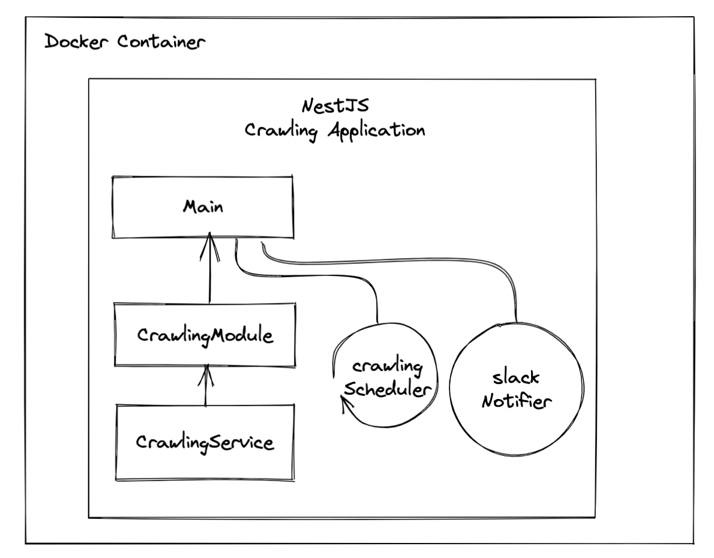
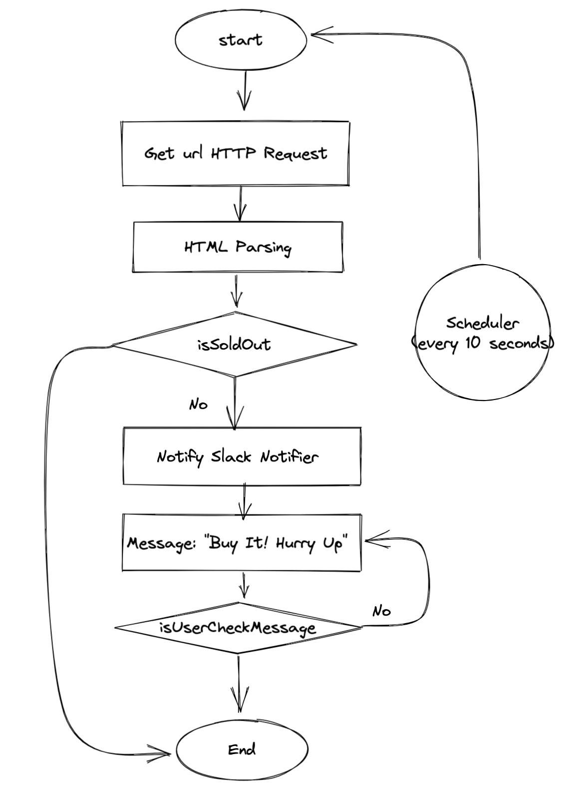

# NestJS의 TDD + 크롤링

최근 Java Spring 공부하다가 TDD, DI 등 NestJS를 하면서 얼렁뚱땅 넘어간 개념들을 다시 톺아보는 기회를 가졌었다.
최근에 테크 유튜브 잇섭님이 주연테크 [V28UE 모니터 제품을 리뷰](https://www.youtube.com/watch?v=1uzMtHt1QBI&t=11s)하면서 해당 제품이 한달 째 재고가 없다... 🥲

그래서 이번 기회에 NestJS에 Jest 테스트 도구로 테스트 주도 개발론을 직접 적용 해봄으로써 TDD에 한 걸음 더 다 가보자.

## 1. Overview

### 1-1. Architecture



### 1-2. FlowChart



- [x] CrawlingService
- [x] Scheduler
- [x] Slack Notifier
- [x] Run on Docker Container

### 1-3. Setting Up Package

우선 필요한 패키지들을 설치해줍니다.

> [NestJS Testing](https://velog.io/@1yongs_/NestJS-Testing-Jest)

```
> npm i --save-dev @nestjs/testing
> npm i --save @nestjs/axios
```

그리고 package.json에서 jest setting 에 `verbose: true` 를 줘야지 테스트 돌리고나서 좀 자세하게 나온다. ~~(어쩐지 console.log도 안보이더라...)~~ 😒 그리고 jest에서 rootDir를 src로 쓸려면 `moduleNameMapper`를 jest config에서 설정해줘야한다.

```json
{
  // ...

  "jest": {
    // ...

    "verbose": true, // test 할 때 자세히 보기 설정
    "moduleNameMapper": {
      // rootDir를 src로 설정.
      "^src/(.*)$": "<rootDir>/$1"
    }
  }
}
```

<br/>
<hr>

## 2. watcher Service

재고상태를 요청하는 watcher service를 만들어 봅시다.

### 2-1. watcher service를 만들어 줍니다.

```
> nest generate module watcher
> nest gnereate service watcher
```

그러면 `watcher.service.spec.ts` 파일이 만들어지는데 이 파일이 `watcher.service.ts` 에 대한 테스트를 담당합니다.

### 2-2. 우선 시나리오를 통해 `WatcherService` 에서 어떤 것을 해야할 지 파악해보죠.

1. Get URL HTTP Request

2. Parse HTML

3. check Sold Out

4. Notify Slack Notifier

### 2-3. 그리고 Test 코드를 먼저 작성합시다. (TDD)

```ts
describe('getHTTPRequest()', () => {
  it.todo('should request http given url');
  it.todo('should throw exception cant request http'); // TODO:
});

describe('parseHtmlAndCheckIsSoldOut()', () => {
  it.todo('should parse Html And Check Is SoldOut');
  it.todo('should parse Html And Check Is SoldOut is false');
});

describe('notify()', () => {
  it.todo('should notify to SlackNotifer');
  it.todo('should throw exception cant notify slacknotifier'); // TODO:
});
```

하나 하나씩 Test들을 만들어 나갑시다.

### 2-4. Get URL HTTP Request

구현하기 전에 테스트 코드를 먼저 작성합시다.

```ts
it('should request http given url', async () => {
  // given
  const givenUrl = 'https://www.naver.com';

  // when
  const result = await watcherService.getHttpRequest(givenUrl);

  // then
  expect(result).not.toBeNull();
});
```

이렇게 작성하고 돌리시면 당연히 에러가 나겠죠. 당연합니다.

### 2-5. 이제 이 코드를 잘 돌아가게끔 수정합시다.

(요즘 axios는 rxjs를 써서 하는게 대세인가봅니다... 배울게 너무 많아 🥲)

```ts
// carwler.service.ts
async getHttpRequest(givenUrl: string) {
  const result = await firstValueFrom(
    this.httpService.get(givenUrl).pipe(map((response) => response.data)),
  );

  WatcherService.logger.log(result);
  return result;
}
```

### 2-6. 결과

그럼 결과 메세지로 이렇게 뜨고 `passed` 되었다고 합니다.


그럼 나머지 테스트 코드도 작성해봅시다. ([링크](./src/watcher/watcher.service.spec.ts))

<br/>
<hr>

## 3. NotifyModule

알림을 줘야하는데 알림은 slack 에 message를 보내는 행위로 알림을 쳤습니다.

### 3-1. Setting Up

```sh
> npm i nestjs-slack-webhook
> npm i @slack/client @nestjs/config
```

- SlackConfig 등록 (webhook)

  - `.env` file
    ```env
    SLACK_WEBHOOK_URL=https://hooks.slack.com/services/T02EQKL🤫🤫🤫🤫
    ```
  - `src/config/slack.config.ts` file

    ```ts
    import { registerAs } from '@nestjs/config';
    import { SlackOptions } from 'nestjs-slack-webhook';

    export default registerAs(
      'slack',
      (): SlackOptions => ({
        url: process.env.SLACK_WEBHOOK_URL,
      }),
    );
    ```

- SlackModule Global로 등록

  - `src/config/slack.config.ts` file

    ```ts
    // ...
    import { ConfigModule, ConfigService } from '@nestjs/config';
    import slackConfig from './config/slack.config';
    import { WatcherModule } from './watcher/watcher.module';

    @Module({
      imports: [
        ConfigModule.forRoot({
          ignoreEnvFile: true,
          load: [slackConfig],
        }),
        SlackModule.forRootAsync({
          imports: [ConfigModule],
          inject: [ConfigService],
          useFactory: (config) => config.get('slack'),
        }),
        // ...
      ],
      // ...
    })
    export class AppModule {}
    ```

- NotifyService

  ```ts
  import { Injectable } from '@nestjs/common';
  import { IncomingWebhook, IncomingWebhookSendArguments } from '@slack/client';
  import { InjectSlack } from 'nestjs-slack-webhook';

  @Injectable()
  export class NotifyService {
    constructor(
      @InjectSlack()
      private readonly slack: IncomingWebhook,
    ) {}

    async notify(args: IncomingWebhookSendArguments) {
      return await this.slack.send(args);
    }
  }
  ```

### 3-2. WatcherService Test Code 작성

```ts
it('should notify to slack', async () => {
  // given
  const requestNotify: IncomingWebhookSendArguments = {
    text: 'Buy It! Hurry Up!',
  };
  const resultNotify: IncomingWebhookResult = {
    text: requestNotify.text,
  };
  const notifyServiceNotifySpy = jest
    .spyOn(notifyService, 'notify')
    .mockResolvedValue(resultNotify);

  // when
  const result = await watcherService.notify();

  // then
  expect(notifyServiceNotifySpy).toHaveBeenCalledTimes(1);
  expect(result).toBe(resultNotify);
});
```

### 3-3. WatcherService notify method 작성

```ts
@Injectable()
export class WatcherService {
  constructor(
    // ...
    private readonly notifyService: NotifyService,
  ) {}

  // ...

  async notify(requestNotifyToSlack: IncomingWebhookSendArguments) {
    return await this.notifyService.notify(requestNotifyToSlack);
  }
}
```

<br/>
<hr/>

## 4. Task Scheduler

### 4-1. Setting Up Task Scheduler

스케쥴링에 필요한 패키지를 설치.

```sh
> npm install --save @nestjs/schedule
> npm install --save-dev @types/cron
```

### 4-2. Scheduler

매 5초마다 request를 요청하는 scheduler를 만든다. (넘 심한가...?)

```ts
@Injectable()
export class TaskSchedulerService {
  private static readonly logger = new Logger(TaskSchedulerService.name);

  constructor(
    private readonly watcherService: WatcherService,
    private readonly schedulerRegistry: SchedulerRegistry,
  ) {}

  @Cron(CronExpression.EVERY_5_SECONDS, {
    name: 'V28UE_WATCHING',
  })
  async handleWatchingStock() {
    const requestUrl =
      'https://www.jooyonshop.co.kr/goods/goods_view.php?goodsNo=1000000165';
    // TaskSchedulerService.logger.debug('아이고난!');
    const resultRequest = await this.watcherService.getHttpRequest(requestUrl);
    const isSoldOut =
      this.watcherService.parseHtmlAndCheckIsSoldOut(resultRequest);

    if (!isSoldOut) {
      const job = this.schedulerRegistry.getCronJob('V28UE_WATCHING');
      job.stop();
      TaskSchedulerService.logger.debug('떳따!');
      this.watcherService.notify({ text: 'Buy It! Hurry Up!' });
    } else {
      TaskSchedulerService.logger.debug('아직 안떴따');
    }
  }
}
```

<br/>
<hr/>

## 5. Docker

Cocker image를 만들고 container에 올려 봅시다.

### 5-1. Dockerfile

```docker
FROM node:lts

WORKDIR /app
# 소스 추가
COPY . .
COPY package*.json ./
RUN npm install
COPY .env .env
# 소스 빌드
RUN npm run build
CMD ["node", "dist/main"]
```

### 5-2. Docker build & run

```sh
> docker build -t nestjs-api:latest .
> docker run -d --name nestjs-api -p 3000:3000 nestjs-api:latest
```

<br/>
<hr/>

## 아이고난! 😫

### 1. NestJS의 Mocking이 나에겐 쉽지가 않다!

> **참고**
>
> - [JHyeok - NestJS에서 단위 테스트 작성하기](https://jhyeok.com/nestjs-unit-test/)
> - [Nest + Jest unit test (1~5) Mocking (강츄!)](https://darrengwon.tistory.com/998?category=915252)

모킹을 대충하지말고 제대로 해보자 ㅡㅡ

우선 NotifyService Mock 객체를 만들어 주자

```ts
const mockNotifyService = {
  notify: jest.fn(),
};
```

그리고 notifyService를 TestModule에 주입합시다.

```ts

describe('WatcherService', () => {
  // ...
  let notifyService: NotifyService;

  beforeEach(async () => {
    const module: TestingModule = await Test.createTestingModule({
      // ...
      providers: [
        // ...
        { provide: NotifyService, useValue: mockNotifyService }, // <- 주입
      ],
    }).compile();
```

test 코드를 작성할때 `NotifyService`를 jest의 `spyOn` 의 기능으로 메서드 구라를 칩시다.
또한 `toHaveBeenCalledTimes`, `toHaveBeenCalledWith` 메서드로 해당 method가 수행 되었는지 체크합시다.

```ts
describe('notify()', () => {
  it('should notify to slack', async () => {
    // given
    const requestNotify: IncomingWebhookSendArguments = {
      text: '(test-code) Buy It! Hurry Up!',
    };
    const resultNotify: IncomingWebhookResult = {
      text: 'ok',
    };
    jest
      .spyOn(notifyService, 'notify')
      .mockImplementation(
        async (arg: IncomingWebhookSendArguments) => resultNotify,
      );

    // when
    const result = await watcherService.notify(requestNotify);

    // then
    // expect(notifyService.notify).toHaveBeenCalledTimes(1);
    expect(result).toEqual(resultNotify);

    expect(notifyService.notify).toHaveBeenCalledTimes(1);
    expect(notifyService.notify).toHaveBeenCalledWith(requestNotify);
  });
});
```

그럼 결과로 test를 통과하게 할 수 있게 되었습니다.

```shell
 PASS  src/crawler/watcher.service.spec.ts
  WatcherService
    ✓ should be defined (9 ms)
    getHTTPRequest()
      ✓ should request http given url (4 ms)
    parseHtmlAndCheckIsSoldOut()
      ✓ should parse Html And Check Is SoldOut (8 ms)
      ✓ should parse Html And Check Is SoldOut is false (4 ms)
    notify()
      ✓ should notify to slack (2 ms)
```

### 2. Dockerfile에서 Build stage 전에 Test 를 수행을 넣어보자!

dockerfile을 작성한다.

```docker
# First stage: build and test
FROM node:10-alpine as nodebuild    # Define the base image
WORKDIR /app                        # Define where we put the files
COPY . .                            # Copy all files from local host folder to image
RUN npm install && \                # Install dependencies
    npm run build && \              # Build the solution
    npm run test && \               # Run the tests
    npm run coverage                # Report on coverage

# Second stage: assemble the runtime image
FROM node:10-alpine as noderun      # Define base image
WORKDIR /app                        # Define work directory
COPY --from=nodebuild /app/dist/src/ ./ # Copy binaries resulting from stage build
COPY package*.json ./               # Copy dependency registry
RUN npm install --only=prod         # Install only production dependencies
EXPOSE 8000
ENTRYPOINT node /app/index.js       # Define how to start the app.
```

test를 돌릴 image와 runtime 이미지를 따로 build한다.

```sh
> docker build . -t noti
> docker build --target nodebuild . -t noti-test:latest
```

그리고 test Image를 container로 실행하고, 결과 파일들을 받아온다.

```sh
> docker run --name noti-test noti-test
> docker cp noti-test:/app/coverage ./results
```

그리고 runtime image를 container로 실행한다.

```sh
> docker run -d --name noti-run noti
```

> ### 참고
>
> [Using Docker Multi-Stage Builds To Build And Test Applications](https://www.feval.ca/posts/multistage-docker/)

### 3. 이러한 도커 수행 과정을 docker-compose로 구성해보자.

```yaml
version: '3.8'

services:
  test:
    container_name: noti-test
    image: noti-test:latest
    build:
      context: .
      target: nodebuild
      dockerfile: ./Dockerfile
  run:
    container_name: noti
    image: noti:latest
    build:
      context: .
      dockerfile: ./Dockerfile
    ports:
      - 3000:3000
    networks:
      - noti-network
    restart: unless-stopped

networks:
  noti-network:
```

실행은 background에서 하도록 하자.

```sh
> docker-compose up -d test
> docker-compose up -d run
```

❓ test를 하고 test result를 복사하려는데 어떻게 하지..?

<br/>
<hr/>

## 참고

1. [🖨 '웹 크롤러' 좀 그만 만들어라](https://velog.io/@mowinckel/%EC%9B%B9-%ED%81%AC%EB%A1%A4%EB%A7%81-I)

- 결과적으로 내가 만들고 있는건 크롤러가 아니라 Watcher? 겠네요 수정해야게땀; ㅎㅎ
