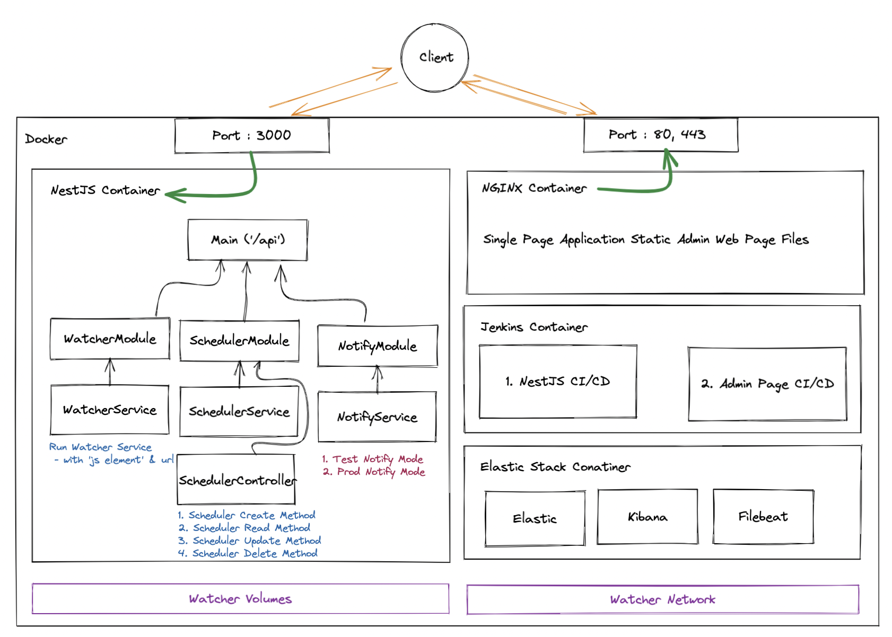

# NestJS의 TDD + Watcher v2

## Overview

한 아이템에만 재고 알림을 걸지말고 다른 아이템에 대해서도 재고 알림을 만들면 어떨까 해서 v2 를 대략적으로 생각했다.

### Structure



1. NestJS

   - 재고 알림 메인 로직 담당 애플리케이션.
   - 재고 알림을 더 추가하려고 REST API 요청을 통해 스케쥴을 CRUD 한다.
   - WatcherService에서는 재고 알림에 대한 더 구체적인 정보를 요청한다. (JS Element, URL)
   - NotifyService에서는 Test환경과 배포환경에서의 알림을 구분하여 이용자들의 혼란을 방지한다.

2. NGINX

   - 기본적인 ADMIN Page를 Single Page Application을 만들어 NGINX를 통해 노출한다.

3. Jenkins

   - Jenkins을 통해 CI CD 과정을 자동화 한다.

4. ELK

   - 로그를 Elastic Stack을 통해 추적, 조회 할 수 있다.

<hr>

## NestJS Application

### 1. 재고 알림 REST API

### 2. 재고 확인 parser 수정

### 3. Test 환경, 배포 환경 구분

<hr>

## NGINX

### 1. NGINX Container 구축

### 2. SPA Static web files 생성

<hr>

## Jenkins

Docker와 함께쓰는 배포 자동화를 진행한다.

### 1. Jenkins Set Up

docker-compose에 jenkins을 설정해줍니다.

```yaml
version: '3.8'

services:
  # ....

  jenkins:
    image: jenkins/jenkins:lts
    container_name: jenkins
    restart: always
    volumes:
      - ./jenkins_home:/var/jenkins_home
      - /var/run/docker.sock:/var/run/docker.sock
    ports:
      - 8081:8080
      - 50000:50000
    environment:
      TZ: 'Asia/Seoul'
```

그리고 container를 올려줍니다.

```sh
> docker-compose up -d jenkins
```

올리고나서 몇 초쯤 지나면 `localhost:8081`로 jenkins client로 접속이 되는데, 비밀번호를 입력하라고 합니다. 비밀번호는 아래의 명령어로 얻을 수 있으며, 비밀번호를 통해 로그인 해줍니다.

```sh
> docker exec jenkins cat /var/jenkins_home/secrets/initialAdminPassword
```

로그인 하면 자동화툴 플러그인을 설치하라고 하는데 `Install suggested plugins` 버튼을 통해 설치를 해줍니다.

설치가 끝나고 admin 계정을 설정하면 home화면이 나온다.

### 2. Github access Token

프로젝트를 추가하기전에 github hook을 사용하기 위한 access Token을 발급해준다.

`Jenkins 관리` 탭의 `시스템 설정`에서 발급 받은 Token으로 Github 계정을 추가해준다.

Credentials 항목에서 `-add-` 버튼을 누르면 `Jenkins Credentials Providers` dialog가 뜨는데 해당 창을 통해 secret key를 만들어 준다.

Test connection을 통과하면 저장하고 적용해 주자.

### 3. Jekins Add Project

다시 Jenkins로 돌아와서 왼쪽 사이드바에서 `새로운 item`을 눌러서 프로젝트를 추가해 준다.

프로젝트 이름을 설정해주고, Freestyle Project 를 통해 젠킨스 프로젝트를 생성해준다.

Github Repository 추가해주고

소스 코드 관리에서 repository 와 credential을 적어주고 branch를 적어준다.

빌드유발은 `GitHub hook trigger for GITScm polling`로 설정해준다.

Build에서는 execute shell로 아래를 입력해준다.

```sh
docker build -t noti:$BUILD_NUMBER --target noderun -f Dockerfile .
docker stop noti && docker rm noti | true
docker run -d -v -p 3000:3000 --name noti noti:$BUILD_NUMBER
```

github repository의 settings - Webhooks 탭에서 `add hocks` 해준다.

> ### 참고
>
> [Docker & Jenkins 구성 및 자동배포](https://velog.io/@sdg9670/Jenkins-%EA%B5%AC%EC%84%B1-%EB%B0%8F-%EC%9E%90%EB%8F%99%EB%B0%B0%ED%8F%AC)

<hr>

## ELK

### 1. ELK Container 생성

### 2. NestJS Log 생성
