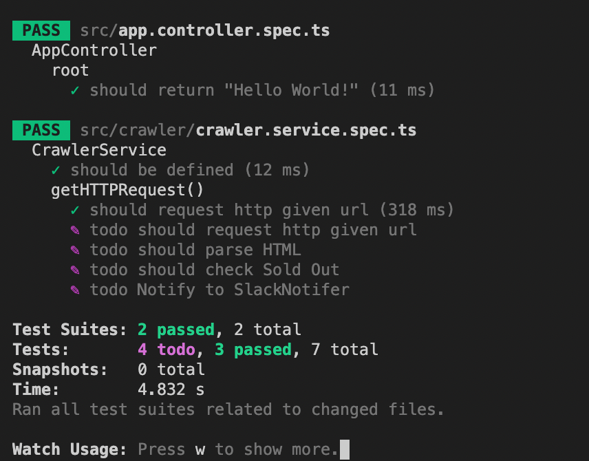

# NestJS의 TDD + 크롤링

최근 Java Spring 공부하다가 TDD, DI 등 NestJS를 하면서 얼렁뚱땅 넘어간 개념들을 다시 톺아보는 기회를 가졌었다.
최근에 테크 유튜브 잇섭님이 주연테크 [V28UE 모니터 제품을 리뷰](https://www.youtube.com/watch?v=1uzMtHt1QBI&t=11s)하면서 해당 제품이 한달 째 재고가 없다... 🥲

그래서 이번 기회에 NestJS에 Jest 테스트 도구로 테스트 주도 개발론을 직접 적용 해봄으로써 TDD에 한 걸음 더 다 가가고, 또한 Toss에서 Web Automation 직군(자꾸떨어진다 ㅠㅠ)에서 크롤링 기술을 요구 하는 등 크롤링 기술을 이번 기회에 적용해본다.

## Overview

### Architecture


### FlowChart


- [ ] CrawlingService
- [ ] Scheduler
- [ ] Slack Notifier
- [ ] Run on Docker Container

### Setting Up Package

우선 필요한 패키지들을 설치해줍니다.

> [NestJS Testing](https://velog.io/@1yongs_/NestJS-Testing-Jest)

```
> npm i --save-dev @nestjs/testing
> npm i --save @nestjs/axios
```

그리고 package.json에서 jest setting 에 `verbose: true` 를 줘야지 테스트 돌리고나서 좀 자세하게 나온다. ~~(어쩐지 console.log도 안보이더라...)~~ 😒

```json
{
  // ...

  "jest": {
    // ...

    "verbose": true
  }
}
```

## 2. Cralwer Service

crawler service를 만들어 줍니다.

```
> nest generate module cralwer
> nest gnereate service cralwer
```

그러면 `cralwer.service.spec.ts` 파일이 만들어지는데 이 파일이 `crawler.service.ts` 에 대한 테스트를 담당합니다.

우선 시나리오를 통해 `CrawlerService` 에서 어떤 것을 해야할 지 파악해보죠.

1. Get URL HTTP Request

2. Parse HTML

3. check Sold Out

4. Notify Slack Notifier

그리고 Test 코드를 먼저 작성합시다. (TDD)

```ts
describe('getHTTPRequest()', () => {
  it.todo('should request http given url');
  it.todo('should parse HTML');
  it.todo('should check Sold Out');
  it.todo('Notify to SlackNotifer');
  it.todo('should request http given url');
});
```

하나 하나씩 Test들을 풀어 나갑시다.

### 1. Get URL HTTP Request

```ts
it('should request http given url', async () => {
  // given
  const givenUrl = 'https://www.naver.com';

  // when
  const result = await crawlerService.getHttpRequest(givenUrl);

  // then
  expect(result).not.toBeNull();
});
```

이렇게 작성하고 돌리시면 당연히 에러가 나겠죠. 당연합니다. 이제 이 코드를 잘 돌아가게끔 수정합시다.
(요즘 axios는 rxjs를 써서 하는게 대세인가봅니다... 배울게 너무 많아 🥲)

```ts
// carwler.service.ts
async getHttpRequest(givenUrl: string) {
  const result = await firstValueFrom(
    this.httpService.get(givenUrl).pipe(map((response) => response.data)),
  );
  CrawlerService.logger.log(result);
  return result;
}
```

그럼 결과 메세지로 이렇게 뜨고 `passed` 되었다고 합니다.


그럼 나머지 테스트 코드도 작성해봅시다.

```

```
